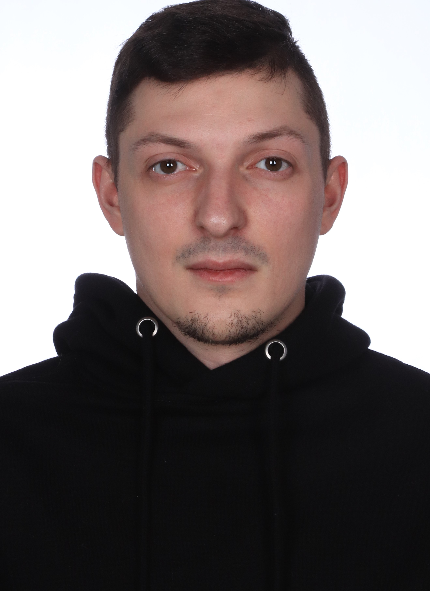

- **СМИРНОВ СТЕПАН АЛЕКСЕЕВИЧ** 

**Тестировщик QA**

- **Адрес:**
г. Кировск (Ленинградская область), ближайшее метро ул. Дыбенко (Санкт-Петербург)

- **Возраст:** 28 лет
  
- **Образование:**
Кировский политехнический техникум, курс - Прикладна информатика, образование - техническое. Закончил в 2013 году.

- **Дополнительные курсы:** 
Нетология , курс - Инженер по тестированию ПО уровня MIDDLE. Закончу в 2023 году.

- **Навыки:**
● jira
● тест-кейсы
● sql
● html
● css
● java
● python
● ios
● android
● git
● Postman, Charles
Функциональное
тестирование
●
● Сценарии теста
● Баг-трекингы

- **О СЕБЕ:**
О себе могу рассказать только то, что к любой работе
всегда относился максимально ответственно, никогда не
боялся сложностей и старался выполнить максимально
качественно, последние 6 лет работаю на одном месте
(Оператором по изготовлению резиновой смеси на
современном заводе Nokian Tyres) знаю, что такое
монотонная и кропотливая работа, сейчас я прохожу
обучение на курсах Нетологии и дополнительно черпаю
информацию о новой профессии из других полезных
источников, в данный момент есть цель найти хорошую
работу по новой профессии и начинать получать опыт в
работе и повышать квалификацию!

- **Доп. Инфо:**

Семейное положение: Женат

1 ребенок.

- **Языки:**
  
Английский В1-средний

- **Контакты:**

8 (951) 689 25 04

stunlooksteff@gmail.com